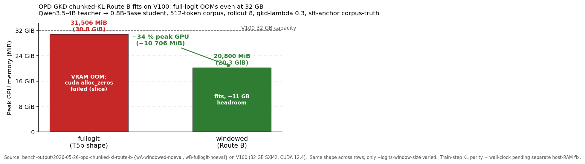
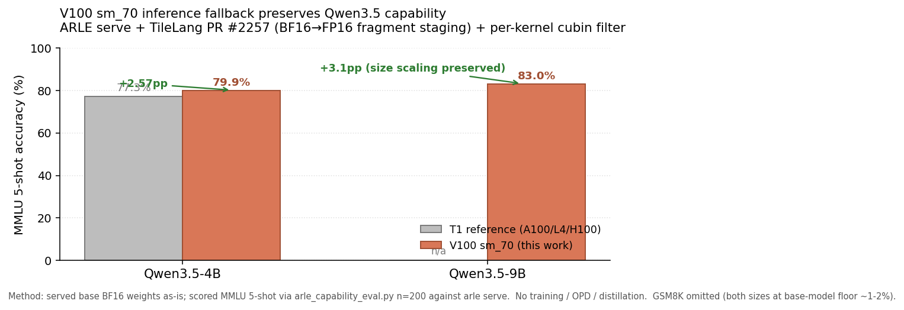

<p align="center">
  <strong>ARLE</strong><br>
  <em>Pure-Rust runtime for serving, local agents, On-Policy Distillation, and evaluation. <code>infer</code> is the OpenAI-compatible serving binary; <code>arle</code> is the unified front door.</em>
</p>

<p align="center">
  <a href="https://cklxx.github.io/arle/"></a>
  <a href="https://github.com/cklxx/arle/actions/workflows/ci.yml"></a>
  <a href="https://github.com/cklxx/arle/actions/workflows/cuda-ci.yml"></a>
  <a href="https://github.com/cklxx/arle/actions/workflows/metal-ci.yml"></a>
  <a href="LICENSE"></a>
  <a href="https://github.com/cklxx/arle/releases"></a>
</p>

<p align="center">
  <a href="#quick-start">Quick Start</a> ·
  <a href="docs/http-api.md">HTTP API</a> ·
  <a href="docs/support-matrix.md">Support Matrix</a> ·
  <a href="docs/architecture.md">Architecture</a> ·
  <a href="ROADMAP.md">Roadmap</a> ·
  <a href="CHANGELOG.md">Changelog</a>
</p>

<p align="center">
  <strong>English</strong> · <a href="README.zh-CN.md">简体中文</a>
</p>

---

## Quick Start

```bash
# Apple Silicon — Homebrew
brew install cklxx/tap/arle

# Apple Silicon or Linux x86_64 — one-line installer
curl -fsSL https://github.com/cklxx/arle/releases/latest/download/install.sh | sh

# Linux + NVIDIA — Docker, no compile
docker run --rm --gpus all -p 8000:8000 -v /path/to/Qwen3.5-4B:/model:ro \
  ghcr.io/cklxx/arle:latest serve --backend cuda --model-path /model

# From source (any backend)
cargo build --release --features cuda --bin arle     # Linux + NVIDIA
cargo build --release --no-default-features --features metal,no-cuda,cli --bin arle  # Apple Silicon
```

Full install matrix + uninstall: [docs/install.md](docs/install.md).

**Serve:**

```bash
arle serve --backend cuda  --model-path /path/to/Qwen3.5-4B --port 8000
arle serve --backend metal --model-path mlx-community/Qwen3.5-0.8B-MLX-4bit --port 8000
```

**Talk to it (OpenAI-compatible):**

```python
from openai import OpenAI
client = OpenAI(base_url="http://localhost:8000/v1", api_key="not-needed")
print(client.chat.completions.create(
    model="qwen3.5-4b",
    messages=[{"role": "user", "content": "Hello from ARLE"}],
).choices[0].message.content)
```

**Local agent / self-check:**

```bash
arle                              # interactive REPL with python/shell tools
arle run --prompt "Summarize this repo" --model-path /path/to/Qwen3.5-4B
arle --doctor --json              # CI-friendly self-check
```

More copy-paste: [`examples/`](examples/).

---

## Status at a glance

| Backend | Platform | Status | Headline |
|---|---|:---:|---|
| **CUDA** | Linux + NVIDIA | **Stable** | Continuous batching, paged KV, radix-backed reuse, TileLang BF16 attention, CUDA Graph decode. L4 / Qwen3.5-4B BF16 + FP8 KV: **197 tok/s @ c=16 / 4k-in**. |
| **Metal** | Apple Silicon | **Beta** | Scheduler-backed serving, chunked prefill, replay prefix reuse. Qwen3.6 35B-A3B 4-bit MLX: **85.6 tok/s decode / 385 ms TTFT** on M4 Pro 48GB. |
| **Metal DFlash** | Apple Silicon | **Beta — default-on** | Speculative decode for Qwen3.5. Qwen3.5-4B-4bit bit-identical, c=1..8. |
| **OPD train (CUDA)** | Linux + NVIDIA | **Beta** | **2.49–2.91× faster than HuggingFace TRL `GKDTrainer`** at matched Qwen3-0.6B setup. **LoRA-only: 0.140 s/step at 3.9 GB peak** — fits 4 GB consumer cards. `arle train opd --student-model <dir>` ships end-to-end. See [Latest Updates](#latest-updates). |
| **CPU** | Portable | **Dev-only** | Smoke tests; not a perf target. |

Models: **Qwen3.5 family** (0.8B / 4B / 30B-A3B / 35B) on CUDA + Metal. Next-model queue: **DeepSeek V4 (#1)** → **Qwen 3.6 (#2)** — see [ROADMAP.md](ROADMAP.md#next-model-priority-order).

Authoritative tier matrix: [docs/support-matrix.md](docs/support-matrix.md) · [docs/stability-policy.md](docs/stability-policy.md).

### DSv4-Flash · 8×H20 workload performance

<p align="center"></p>

Measured on **DeepSeek-V4-Flash** with the **legacy CSA prefill kernel** (8×H20, TP=8, fp8 KV cache, num-slots=4). Decode TPOT is shape-insensitive (~26 ms/token); prefill TTFT scales linearly with prompt length (~7 ms/token). The FlashMLA SM90 sparse-prefill backend (V2 work-in-progress, env-opt-in via `ARLE_DSV4_FLASHMLA_PREFILL=1`) ships an experimental fast path for chunks where `token_count` is a multiple of 64 — see [`docs/experience/wins/2026-05-27-dsv4-flashmla-v2-22x-prefill-22x-pre-crash.md`](docs/experience/wins/2026-05-27-dsv4-flashmla-v2-22x-prefill-22x-pre-crash.md) for the in-flight axis.

---

## Why ARLE

In agent and RL workloads every turn pays a **prefill tax**: system prompt + history + tool results re-process every turn. ARLE treats this as the core problem in both serving and training:

- **Multi-turn KV reuse.** Slot-sticky reuse + radix-backed tiered KV (`T0 GPU → T1 host → T2 disk → T3 cluster`) keep prior-turn KV hot.
- **Paged KV pool.** `page_size=16` with direct GPU page attach + tail-page CoW for shared prefixes — predictable accounting, cheap prefix sharing.
- **Shared runtime authority.** `infer`, `arle`, and the OPD training loop share one Rust runtime + model code path — the OPD teacher is the production-serving runtime, not a separate stack.

Architecture deep-dive: [docs/architecture.md](docs/architecture.md) · [docs/codebase-map.md](docs/codebase-map.md).

---

## Entry surfaces

`arle` is the single binary:

| Command | What it does |
|---|---|
| `arle` (no args) | Interactive agent REPL with `python` and `shell` tools. |
| `arle run --prompt "…"` | One-shot agent prompt. `--no-tools` to disable tools. |
| `arle serve --backend …` | OpenAI-compatible HTTP server. |
| `arle train opd` | **On-Policy Distillation** — teacher in `infer`, student in `train`. CUDA path. [Usage manual](docs/projects/2026-05-21-arle-opd-cuda-usage-manual.md). |
| `arle --doctor [--json]` | Backend / hardware / model-resolution self-check. |

Operators wanting only the serving binary can use `infer` directly — same HTTP contract, without agent / train surfaces.

---

## Latest Updates

<!-- Last 2-3 entries. Achievements only. Older history → CHANGELOG.md. -->

**2026-05-26 — OPD GKD chunked-KL Route B fits the 512-token corpus shape; full-logit OOMs even on V100 32 GB.**
Real-corpus Qwen3.5-4B → 0.8B-Base GKD with corpus-truth SFT anchor at `prompt-max-tokens=512` previously [KILLed on consumer 16 GB hardware](docs/experience/errors/2026-05-25-chunked-kl-real-corpus-512-kill.md) because chunking the KL loss left full `[B, S, V]` teacher + student logits resident before the loss saw them. Route B (`SequenceWindowedForward` trait + per-window `tape.backward(window_loss)`, never materialize `[B, S, V]`, slice hidden then `lm_head` per window) lands the structural fix and is now validated end-to-end on Tesla V100-SXM2-32GB.



| Mode | `--logits-window-size` | Peak GPU | Train step 1 | Outcome |
|---|---:|---:|---:|---|
| **fullogit** (T5b shape) | off | **31 506 MiB** | n/a | **VRAM OOM** — `cuda alloc_zeros failed (slice)` |
| **windowed** (Route B) | 64 | **25 440 MiB** | **897.4 s** (rollout 112 / teacher 168 / student 78 / backward 538) | loss 9.72 × 10⁻⁶, RSS 9.22 GB post-train |

Same corpus + rollout + GKD config across rows; only `--logits-window-size` varied. **−19 % peak GPU + train step lands** (was OOM). Two structural fixes were needed end-to-end: per-window forward (Route B itself, never materialize `[B, S, V]`) plus `evict_host_mirror` to drop 19.8 GB → 2.1 GB of host RAM held by post-upload weight mirrors. On V100 32 GB the windowed path now runs the full GKD step the unwindowed path cannot start.

Evidence: [wins entry](docs/experience/wins/2026-05-26-opd-chunked-kl-route-b-bench.md) · [design plan (Route B)](docs/plans/2026-05-25-sequence-windowed-forward-design.md) · [prior 16 GB KILL](docs/experience/errors/2026-05-25-chunked-kl-real-corpus-512-kill.md)

---

**2026-05-25 — V100 (sm_70 Volta) inference target unlocked; capability preserved.**
ARLE serve now runs Qwen3.5-4B/9B on Tesla V100-SXM2-32GB end-to-end. Made it work through an upstream TileLang patch ([PR #2279](https://github.com/tile-ai/tilelang/pull/2279) — fragment-to-fragment dtype-converting copy via shared-memory staging + SM70 `T.gemm` GemmFMA fallback for unsupported BF16/layout combinations) plus an ARLE-side per-kernel `allow_sm70` cubin filter that pins T0-legacy emission to Qwen3.5 dense + GDR chunkwise paths only. **T1 (A100/L4/H100) builds and binaries untouched by construction.**



| MMLU 5-shot (n=200, harness scored ~164-165 valid) | Qwen3.5-4B | Qwen3.5-9B |
|---|---:|---:|
| T1 reference (A100/L4/H100) | 77.33 % | n/a |
| **V100 sm_70 (this work)** | **79.9 %** | **83.0 %** (+3.1 pp size scaling) |

Benefit: a cheap, widely-available Volta box becomes a usable ARLE inference target — same OpenAI-v1 surface, same Qwen3.5 family, no measurable capability cost from the Volta-specific fallback.

Evidence: [P1 build pass](docs/experience/wins/2026-05-25-v100-sm70-p1-build-pass.md) · [P1.4 smoke](docs/experience/wins/2026-05-25-v100-sm70-p1-smoke-pass.md) · [P3.1 4B capability](docs/experience/wins/2026-05-25-v100-sm70-p3-1-capability-qwen35-4b.md) · [P3.2 9B capability](docs/experience/wins/2026-05-25-v100-sm70-p3-2-capability-qwen35-9b.md)

Older entries (OPD CLI ship, OPD pipeline close + HF cross-validation, ARLE-vs-TRL 2.49–2.91×): [CHANGELOG.md](CHANGELOG.md).

---

## Documentation map

- [docs/http-api.md](docs/http-api.md) · HTTP contract & streaming
- [docs/support-matrix.md](docs/support-matrix.md) · backend / model / quant tiers
- [docs/architecture.md](docs/architecture.md) · package boundaries
- [docs/codebase-map.md](docs/codebase-map.md) · workspace layout & execution paths
- [docs/environment.md](docs/environment.md) · env vars & runtime knobs
- [docs/troubleshooting.md](docs/troubleshooting.md) · common build/runtime errors
- [docs/comparison.md](docs/comparison.md) · vs vLLM / SGLang / mistral.rs / llama.cpp
- [CONTRIBUTING.md](CONTRIBUTING.md) · contributor setup & validation
- [examples/](examples/) · copy-paste smoke paths
- [docs/index.md](docs/index.md) · maintainer-facing PARA index

---

## License

[MIT](LICENSE)
