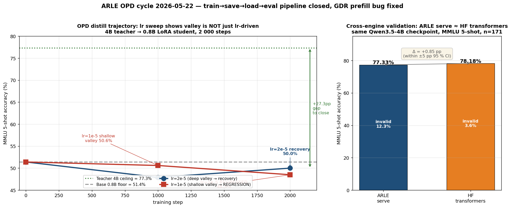
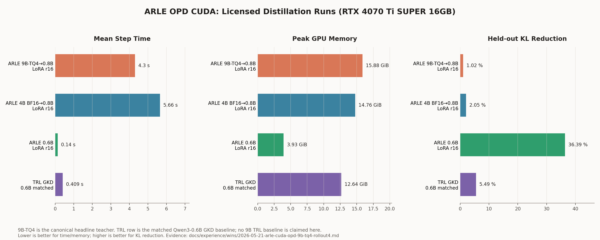

<p align="center">
  <strong>ARLE</strong><br>
  <em>Pure-Rust runtime for serving, local agents, On-Policy Distillation, and evaluation. <code>infer</code> is the OpenAI-compatible serving binary; <code>arle</code> is the unified front door.</em>
</p>

<p align="center">
  <a href="https://cklxx.github.io/arle/"></a>
  <a href="https://github.com/cklxx/arle/actions/workflows/ci.yml"></a>
  <a href="https://github.com/cklxx/arle/actions/workflows/cuda-ci.yml"></a>
  <a href="https://github.com/cklxx/arle/actions/workflows/metal-ci.yml"></a>
  <a href="LICENSE"></a>
  <a href="https://github.com/cklxx/arle/releases"></a>
</p>

<p align="center">
  <a href="#quick-start">Quick Start</a> ·
  <a href="docs/http-api.md">HTTP API</a> ·
  <a href="docs/support-matrix.md">Support Matrix</a> ·
  <a href="docs/architecture.md">Architecture</a> ·
  <a href="ROADMAP.md">Roadmap</a> ·
  <a href="CHANGELOG.md">Changelog</a>
</p>

<p align="center">
  <strong>English</strong> · <a href="README.zh-CN.md">简体中文</a>
</p>

---

## Quick Start

```bash
# Apple Silicon — Homebrew
brew install cklxx/tap/arle

# Apple Silicon or Linux x86_64 — one-line installer
curl -fsSL https://github.com/cklxx/arle/releases/latest/download/install.sh | sh

# Linux + NVIDIA — Docker, no compile
docker run --rm --gpus all -p 8000:8000 -v /path/to/Qwen3.5-4B:/model:ro \
  ghcr.io/cklxx/arle:latest serve --backend cuda --model-path /model

# From source (any backend)
cargo build --release --features cuda --bin arle     # Linux + NVIDIA
cargo build --release --no-default-features --features metal,no-cuda,cli --bin arle  # Apple Silicon
```

Full install matrix + uninstall: [docs/install.md](docs/install.md).

**Serve:**

```bash
arle serve --backend cuda  --model-path /path/to/Qwen3.5-4B --port 8000
arle serve --backend metal --model-path mlx-community/Qwen3.5-0.8B-MLX-4bit --port 8000
```

**Talk to it (OpenAI-compatible):**

```python
from openai import OpenAI
client = OpenAI(base_url="http://localhost:8000/v1", api_key="not-needed")
print(client.chat.completions.create(
    model="qwen3.5-4b",
    messages=[{"role": "user", "content": "Hello from ARLE"}],
).choices[0].message.content)
```

**Local agent / self-check:**

```bash
arle                              # interactive REPL with python/shell tools
arle run --prompt "Summarize this repo" --model-path /path/to/Qwen3.5-4B
arle --doctor --json              # CI-friendly self-check
```

More copy-paste: [`examples/`](examples/).

---

## Status at a glance

| Backend | Platform | Status | Headline |
|---|---|:---:|---|
| **CUDA** | Linux + NVIDIA | **Stable** | Continuous batching, paged KV, radix-backed reuse, TileLang BF16 attention, CUDA Graph decode. L4 / Qwen3.5-4B BF16 + FP8 KV: **197 tok/s @ c=16 / 4k-in**. |
| **Metal** | Apple Silicon | **Beta** | Scheduler-backed serving, chunked prefill, replay prefix reuse. Qwen3.6 35B-A3B 4-bit MLX: **85.6 tok/s decode / 385 ms TTFT** on M4 Pro 48GB. |
| **Metal DFlash** | Apple Silicon | **Beta — default-on** | Speculative decode for Qwen3.5. Qwen3.5-4B-4bit bit-identical, c=1..8. |
| **OPD train (CUDA)** | Linux + NVIDIA | **Beta** | **2.04× faster than HuggingFace TRL `GKDTrainer`** at matched Qwen3-0.6B setup. **LoRA-only: 0.140 s/step at 3.9 GB peak** — fits 4 GB consumer cards. Cross-runtime large-teacher path validated end-to-end (Qwen3.5-4B → 0.8B LoRA). See [Latest Updates](#latest-updates). |
| **CPU** | Portable | **Dev-only** | Smoke tests; not a perf target. |

Models: **Qwen3.5 family** (0.8B / 4B / 30B-A3B / 35B) on CUDA + Metal. Next-model queue: **DeepSeek V4 (#1)** → **Qwen 3.6 (#2)** — see [ROADMAP.md](ROADMAP.md#next-model-priority-order).

Authoritative tier matrix: [docs/support-matrix.md](docs/support-matrix.md) · [docs/stability-policy.md](docs/stability-policy.md).

---

## Why ARLE

In agent and RL workloads every turn pays a **prefill tax**: system prompt + history + tool results re-process every turn. ARLE treats this as the core problem in both serving and training:

- **Multi-turn KV reuse.** Slot-sticky reuse + radix-backed tiered KV (`T0 GPU → T1 host → T2 disk → T3 cluster`) keep prior-turn KV hot.
- **Paged KV pool.** `page_size=16` with direct GPU page attach + tail-page CoW for shared prefixes — predictable accounting, cheap prefix sharing.
- **Shared runtime authority.** `infer`, `arle`, and the OPD training loop share one Rust runtime + model code path — the OPD teacher is the production-serving runtime, not a separate stack.

Architecture deep-dive: [docs/architecture.md](docs/architecture.md) · [docs/codebase-map.md](docs/codebase-map.md).

---

## Entry surfaces

`arle` is the single binary:

| Command | What it does |
|---|---|
| `arle` (no args) | Interactive agent REPL with `python` and `shell` tools. |
| `arle run --prompt "…"` | One-shot agent prompt. `--no-tools` to disable tools. |
| `arle serve --backend …` | OpenAI-compatible HTTP server. |
| `arle train opd` | **On-Policy Distillation** — teacher in `infer`, student in `train`. CUDA path. [Usage manual](docs/projects/2026-05-21-arle-opd-cuda-usage-manual.md). |
| `arle --doctor [--json]` | Backend / hardware / model-resolution self-check. |

Operators wanting only the serving binary can use `infer` directly — same HTTP contract, without agent / train surfaces.

---

## Latest Updates

<!-- Last 1-2 entries. Older history → CHANGELOG.md. -->

**2026-05-22 — ARLE OPD pipeline closed end-to-end, GDR prefill bug fixed.**
4B BF16 teacher → 0.8B-Base LoRA r=16 student, train→save→load→eval loop in one cycle. ARLE serve cross-validated against HF `transformers` reference: same Qwen3.5-4B, MMLU 5-shot n=171, **77.33 % vs 78.18 % (Δ +0.85 pp, statistically equivalent)** — engines agree.



- **Bug fixed:** `arle serve` corruption on prompts ≥ 33 tokens (Qwen3.5 hybrid GDR chunkwise prefill divergence) → MMLU recovered 0/171 invalid → 116/150 = 77.3 % ([`a374108`](https://github.com/cklxx/arle/commit/a374108)).
- **Pipeline closed:** OPD train saves LoRA adapter (PEFT format) → `INFER_LORA_PATH` loads in CUDA serve → `scripts/arle_capability_eval.py` produces before/after MMLU table.
- **Distill trajectory + lr sweep (2k steps each):** OPD U-curve is **fundamental, not just lr-driven**.
  - `lr=2e-5`: base 51.4 % → step 1000 deep valley **47.9 %** (−3.5 pp) → step 2000 recovering **50.0 %** (+2.1 pp).
  - `lr=1e-5`: base 51.4 % → step 1000 shallow valley **50.6 %** (−0.8 pp) → step 2000 **REGRESSED 48.5 %** (−2.1 pp from peak).
  - Lower lr ≠ shallower valley ≠ faster recovery. Neither lr crosses base in 2 k steps. → Need longer horizon (10 k +) or GKD λ-mixing, not just lr tuning.

Evidence: [`serve fix`](docs/experience/wins/2026-05-22-arle-serve-long-prompt-bug-fix.md) · [`pipeline close`](docs/experience/wins/2026-05-22-p1b-train-save-load-eval-loop.md) · [`U-curve diagnosis`](docs/experience/wins/2026-05-22-distill-trajectory-valley-then-recovery.md) · [`lr sweep KILL`](docs/experience/errors/2026-05-22-p2-lr-sweep-not-the-fix.md) · [`cross-validation`](docs/experience/wins/2026-05-22-arle-vs-hf-transformers-cross-validation.md) · [`cycle wrap`](docs/projects/2026-05-22-serve-fix-and-capability-baselines.md)

---

**2026-05-21 — ARLE OPD CUDA: faster + smaller vs HuggingFace TRL.**
Same Qwen3-0.6B teacher/student, 32 prompts, `rollout_len=8`, `lr=1e-7`, 500 steps, AdamW, RTX 4070 Ti SUPER.



| | TRL `GKDTrainer` | **ARLE full-finetune** | **ARLE LoRA r=16** |
|---|---:|---:|---:|
| step time (s) | 0.408 | **0.164** (2.49×) | **0.140** (2.91×) |
| peak GPU memory (GB) | 12.6 | 15.4 | **3.93** (fits 4 GB cards) |
| held-out KL (500 steps) | -5.5 % | **-18.5 %** | **-36.4 %** |

**Cross-runtime large-teacher path validated.** Qwen3.5-4B BF16 teacher in `infer` → Qwen3.5-0.8B-Base LoRA r=16 student in `train` via the `InferTeacher` device-logits bridge. 200-step real-text run: **5.66 s/step**, **14.8 GiB peak**, monotonic KL decrease (held-out -2.05%). Cross-runtime overhead measured at **1.5% of step time** — production-fast teacher integration.

End-to-end convergence verified: held-out exact-overlap **50% → 82.8%** in 5000 steps (lr=1e-7).

Evidence: [`docs/projects/2026-05-21-opd-cuda-cycle-wrap.md`](docs/projects/2026-05-21-opd-cuda-cycle-wrap.md) · [usage manual](docs/projects/2026-05-21-arle-opd-cuda-usage-manual.md) · [TRL head-to-head](docs/experience/wins/2026-05-21-arle-vs-trl-gkd-head-to-head.md) · [4B→0.8B cross-runtime bench](docs/experience/wins/2026-05-21-qwen35-4b-08b-opd-infer-teacher.md).

Full history: [CHANGELOG.md](CHANGELOG.md).

---

## Documentation map

- [docs/http-api.md](docs/http-api.md) · HTTP contract & streaming
- [docs/support-matrix.md](docs/support-matrix.md) · backend / model / quant tiers
- [docs/architecture.md](docs/architecture.md) · package boundaries
- [docs/codebase-map.md](docs/codebase-map.md) · workspace layout & execution paths
- [docs/environment.md](docs/environment.md) · env vars & runtime knobs
- [docs/troubleshooting.md](docs/troubleshooting.md) · common build/runtime errors
- [docs/comparison.md](docs/comparison.md) · vs vLLM / SGLang / mistral.rs / llama.cpp
- [CONTRIBUTING.md](CONTRIBUTING.md) · contributor setup & validation
- [examples/](examples/) · copy-paste smoke paths
- [docs/index.md](docs/index.md) · maintainer-facing PARA index

---

## License

[MIT](LICENSE)
