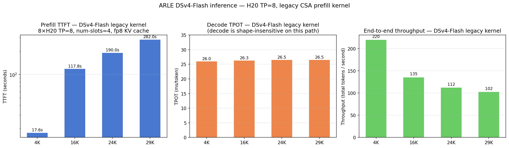
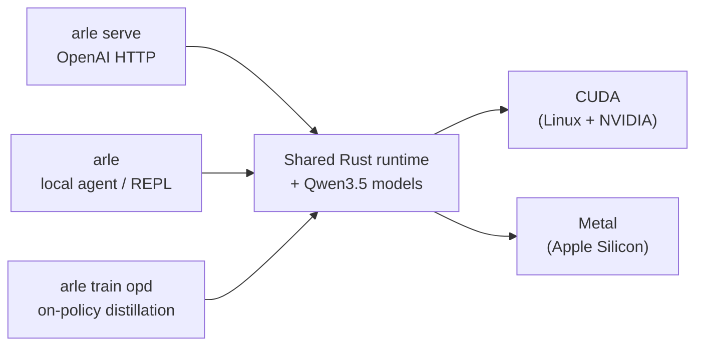

<p align="center">
  <strong>ARLE</strong><br>
  <em>Pure-Rust runtime for serving, local agents, On-Policy Distillation, and evaluation. <code>infer</code> is the OpenAI-compatible serving binary; <code>arle</code> is the unified front door.</em>
</p>

<p align="center">
  <a href="https://cklxx.github.io/arle/"></a>
  <a href="https://github.com/cklxx/arle/actions/workflows/ci.yml"></a>
  <a href="https://github.com/cklxx/arle/actions/workflows/cuda-ci.yml"></a>
  <a href="https://github.com/cklxx/arle/actions/workflows/metal-ci.yml"></a>
  <a href="LICENSE"></a>
  <a href="https://github.com/cklxx/arle/releases"></a>
</p>

<p align="center">
  <a href="#quick-start">Quick Start</a> ·
  <a href="docs/http-api.md">HTTP API</a> ·
  <a href="docs/support-matrix.md">Support Matrix</a> ·
  <a href="docs/architecture.md">Architecture</a> ·
  <a href="ROADMAP.md">Roadmap</a> ·
  <a href="CHANGELOG.md">Changelog</a>
</p>

<p align="center">
  <strong>English</strong> · <a href="README.zh-CN.md">简体中文</a>
</p>

---

## Quick Start

```bash
# Apple Silicon — Homebrew
brew install cklxx/tap/arle

# Apple Silicon or Linux x86_64 — one-line installer
curl -fsSL https://github.com/cklxx/arle/releases/latest/download/install.sh | sh

# Linux + NVIDIA — Docker, no compile
docker run --rm --gpus all -p 8000:8000 -v /path/to/Qwen3.5-4B:/model:ro \
  ghcr.io/cklxx/arle:latest serve --backend cuda --model-path /model

# From source (any backend)
cargo build --release --features cuda --bin arle     # Linux + NVIDIA
cargo build --release --no-default-features --features metal,no-cuda,cli --bin arle  # Apple Silicon
```

Full install matrix + uninstall: [docs/install.md](docs/install.md).

**Serve:**

```bash
arle serve --backend cuda  --model-path /path/to/Qwen3.5-4B --port 8000
arle serve --backend metal --model-path mlx-community/Qwen3.5-0.8B-MLX-4bit --port 8000
```

**Talk to it (OpenAI-compatible):**

```python
from openai import OpenAI
client = OpenAI(base_url="http://localhost:8000/v1", api_key="not-needed")
print(client.chat.completions.create(
    model="qwen3.5-4b",
    messages=[{"role": "user", "content": "Hello from ARLE"}],
).choices[0].message.content)
```

**Local agent / self-check:**

```bash
arle                              # interactive REPL with python/shell tools
arle run --prompt "Summarize this repo" --model-path /path/to/Qwen3.5-4B
arle --doctor --json              # CI-friendly self-check
```

More copy-paste: [`examples/`](examples/).

---

## Status at a glance

| Backend | Platform | Status | Headline |
|---|---|:---:|---|
| **CUDA** | Linux + NVIDIA | **Stable** | 197 tok/s on L4 (Qwen3.5-4B BF16, c=16) |
| **Metal** | Apple Silicon | **Beta** | 85.6 tok/s on M4 Pro (Qwen3.6 35B-A3B 4-bit) |
| **Metal DFlash** | Apple Silicon | **Beta** | Bit-identical spec decode for Qwen3.5 |
| **OPD train (CUDA)** | Linux + NVIDIA | **Beta** | 2.49–2.91× faster than HF TRL `GKDTrainer`; LoRA fits 4 GB cards |
| **CPU** | Portable | **Dev-only** | Smoke tests only |

Models: **Qwen3.5 family** (0.8B / 4B / 30B-A3B / 35B) on CUDA + Metal. Next up: **DeepSeek V4** → **Qwen 3.6** ([ROADMAP](ROADMAP.md#next-model-priority-order)).

Full numbers and tier policy: [support-matrix](docs/support-matrix.md) · [stability-policy](docs/stability-policy.md).

### DSv4-Flash · 8×H20 workload performance

<p align="center"></p>

Measured on **DeepSeek-V4-Flash** with the **legacy CSA prefill kernel** (8×H20, TP=8, fp8 KV cache, num-slots=4). Decode TPOT is shape-insensitive (~26 ms/token); prefill TTFT scales linearly with prompt length (~7 ms/token). The FlashMLA SM90 sparse-prefill backend (V2 work-in-progress, env-opt-in via `ARLE_DSV4_FLASHMLA_PREFILL=1`) ships an experimental fast path for chunks where `token_count` is a multiple of 64 — see [`docs/experience/wins/2026-05-27-dsv4-flashmla-v2-22x-prefill-22x-pre-crash.md`](docs/experience/wins/2026-05-27-dsv4-flashmla-v2-22x-prefill-22x-pre-crash.md) for the in-flight axis.

---

## Why ARLE

Agent and RL workloads waste compute re-processing the same prompt + history + tool output every turn. ARLE fixes this once and shares the fix across serving and training:

- **KV stays hot across turns.** Prior-turn KV is kept on GPU; spills to host / disk / cluster only when memory pressures it.
- **Shared prefixes are cheap.** Pages are reused across requests with the same prefix — no duplicate compute, no duplicate memory.
- **One runtime, three surfaces.** Serving, the local agent, and OPD training all run on the same Rust + model code. The OPD teacher *is* the production server.



Deep dive: [architecture](docs/architecture.md) · [codebase-map](docs/codebase-map.md).

---

## Entry surfaces

`arle` is the single binary:

| Command | What it does |
|---|---|
| `arle` (no args) | Interactive agent REPL with `python` and `shell` tools. |
| `arle run --prompt "…"` | One-shot agent prompt. `--no-tools` to disable tools. |
| `arle serve --backend …` | OpenAI-compatible HTTP server. |
| `arle train opd` | **On-Policy Distillation** — teacher in `infer`, student in `train`. CUDA path. [Usage manual](docs/projects/2026-05-21-arle-opd-cuda-usage-manual.md). |
| `arle --doctor [--json]` | Backend / hardware / model-resolution self-check. |

Operators wanting only the serving binary can use `infer` directly — same HTTP contract, without agent / train surfaces.

---

## Latest Updates

<!-- Breakthrough-only headlines (shipped capability / perf wins). Research notes + retractions live in docs/. -->

**2026-05-26 — V100 Route B lands; OPD GKD now fits the 512-token corpus.** Per-window forward + `evict_host_mirror` cut peak GPU 19% (31.5 → 25.4 GiB) and turned an OOM into a clean train step on V100 32 GB. [Wins entry](docs/experience/wins/2026-05-26-opd-chunked-kl-route-b-bench.md).

**2026-05-25 — V100 (Volta sm_70) inference unlocked.** Qwen3.5-4B/9B serve end-to-end via upstream TileLang patch + per-kernel SM70 filter. MMLU stays at A100/L4 level (4B: 79.9%, 9B: 83.0%). T1 builds untouched. [Wins entry](docs/experience/wins/2026-05-25-v100-sm70-p3-1-capability-qwen35-4b.md).

Older history: [CHANGELOG.md](CHANGELOG.md).

---

## Documentation map

- [docs/http-api.md](docs/http-api.md) · HTTP contract & streaming
- [docs/support-matrix.md](docs/support-matrix.md) · backend / model / quant tiers
- [docs/architecture.md](docs/architecture.md) · package boundaries
- [docs/codebase-map.md](docs/codebase-map.md) · workspace layout & execution paths
- [docs/environment.md](docs/environment.md) · env vars & runtime knobs
- [docs/troubleshooting.md](docs/troubleshooting.md) · common build/runtime errors
- [docs/comparison.md](docs/comparison.md) · vs vLLM / SGLang / mistral.rs / llama.cpp
- [CONTRIBUTING.md](CONTRIBUTING.md) · contributor setup & validation
- [examples/](examples/) · copy-paste smoke paths
- [docs/index.md](docs/index.md) · maintainer-facing PARA index

---

## License

[MIT](LICENSE)
