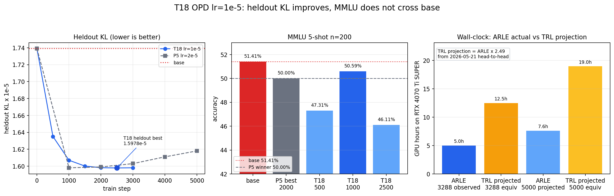

# T18 OPD Recipe Variant Result

Related: `docs/experience/wins/2026-05-25-opd-recipe-variant.md`,
`docs/experience/wins/2026-05-25-p5-pure-opd-5k-capability-sweep.md`, and
`docs/experience/wins/2026-05-21-arle-vs-trl-gkd-head-to-head.md`.

## Context

T18 tested the P5 shape again with only one recipe knob changed:
`lr=1e-5` instead of P5's `lr=2e-5`. Same teacher/student pair
(`Qwen3.5-4B -> Qwen3.5-0.8B-Base LoRA`), same prompt set, `rollout_len=8`,
`prompt_max=16`, and checkpoint cadence `save_every=250`.

The run was stopped cleanly at step 3288 after heldout KL plateaued:
`step_2500 = 1.5978316e-5`, `step_3000 = 1.5980296e-5`. This saved about
3 GPU-hours versus continuing to step 5000. The final saved checkpoint was
`runs/2026-05-25-t18-recipe-variant/lr1e-5/step_003250`.

## What Worked

ARLE ran the 4B-teacher to 0.8B-student LoRA OPD loop for 3288 steps on a
single RTX 4070 Ti SUPER without OOM. The in-loop step timers sum to
`18040.12s` (`5.01h`) for 3288 steps, mean `5.487s/step`; a 5000-step run
projects to `7.62h`.

The lower LR improved the KL trajectory versus P5: T18 reached heldout
`1.5978316e-5` at step 2500, marginally below P5's best heldout row
(`1.598e-5`). That did not translate into a capability headline.



## Student OPD Before And After

Baseline is the no-LoRA Qwen3.5-0.8B-Base row from
`bench-output/2026-05-22-capability-baseline-08b-retry-after-longprompt-fix/summary.json`.
Capability eval uses `scripts/arle_capability_eval.py --tasks mmlu,gsm8k
--n-samples 200` through ARLE's OpenAI-v1 surface.

| Row | train KL | heldout KL | MMLU | GSM8K | Verdict |
| --- | ---: | ---: | ---: | ---: | --- |
| Base no-LoRA | n/a | `1.739055e-5` | **51.41%** (`73/142`, inv 29) | `1.55%` (`3/194`, inv 6) | baseline |
| P5 best capability, step 2000 | `1.318e-5` | `1.599e-5` | `50.00%` (`83/166`, inv 5) | `1.60%` (`3/188`, inv 12) | P5 winner |
| T18 step 500 | `1.445267e-5` | `1.635091e-5` | `47.31%` (`79/167`, inv 4) | `2.62%` (`5/191`, inv 9) | below P5/base |
| T18 step 1000 | `1.404491e-5` | `1.606972e-5` | **50.59%** (`86/170`, inv 1) | **3.16%** (`6/190`, inv 10) | beats P5 MMLU, below base |
| T18 step 2500 | `1.341832e-5` | **`1.597832e-5`** | `46.11%` (`77/167`, inv 4) | `1.67%` (`3/180`, inv 20) | heldout best, capability fails |

After the `step_001000` row passed the P5 MMLU threshold, the user directed
the sweep to prioritize the most promising KL checkpoint (`step_002500`).
That checkpoint failed the early gate (`46.11% < 50.00%`), so the sweep stopped
instead of spending more GPU time on 1500/2000/3000.

## ARLE Vs TRL GKDTrainer

The strongest industry-facing OPD result remains the matched 2026-05-21
head-to-head against HuggingFace TRL `GKDTrainer` on Qwen3-0.6B:

| Runner | Mean step | Peak memory | Heldout KL change |
| --- | ---: | ---: | ---: |
| TRL `GKDTrainer`, constant LR | `0.408s` | `12.6 GB` | `-5.49%` |
| ARLE full-finetune OPD | `0.164s` frontier | `15.4 GB` | `-18.47%` |
| ARLE LoRA q/v r16 | `0.140s` | `3.93 GB` | `-36.39%` |

For T18's larger 4B-teacher to 0.8B-student shape, there is no published TRL
same-shape measurement in this repo. Using the conservative 2026-05-21
`2.49x` TRL/ARLE wall-clock ratio as a projection, the observed T18 3288-step
run would be about `12.5h` in TRL, and a 5000-step run would be about `19.0h`
versus ARLE's projected `7.62h`. This is a projection, not a measured PyTorch
4B -> 0.8B result.

## KL Vs Capability

T18 confirms the P5 lesson: KL is necessary instrumentation but not a capability
headline. The best T18 heldout-KL row has worse MMLU than both base and P5
winner. The best T18 MMLU row beats P5's 50.00% by 0.59 pp, but remains
0.82 pp below the no-LoRA base.

Pure OPD in this recipe family does not yet cross the base model on MMLU.
Capability gain likely needs an anchor such as SFT/GKD, but the real-corpus
GKD attempts are blocked by sequence-windowed forward work
(`docs/plans/2026-05-25-sequence-windowed-forward-design.md`).

## Errors-Style Reflection

Do not promote "lower LR fixes overfit" from this run. Lower LR made the KL
curve cleaner and recovered a P5-threshold MMLU row at step 1000, but the
heldout-KL optimum at step 2500 failed capability. The correct next decision
is not more low-LR pure OPD; it is whether to license the sequence-windowed
forward path needed for real-corpus SFT/GKD anchoring.

README was not updated: the result did not beat the base MMLU row, and the
project README is reserved for achievements, not partial recipe probes.

## Verification

```bash
nvidia-smi
target/release/infer --model-path /home/ckl/.cache/modelscope/hub/Qwen/Qwen3___5-0___8B-Base --port 8125 --num-slots 1 --max-seq-len 4096 --chunked-prefill-size 4096 --max-num-batched-tokens 4096
.venv/bin/python scripts/arle_capability_eval.py --backend arle --base-url http://127.0.0.1:8125 --model-id Qwen3___5-0___8B-Base --tasks mmlu,gsm8k --n-samples 200 --output bench-output/2026-05-25-t18-capability-sweep/<step>
```

Completed sequential evals:

- `bench-output/2026-05-25-t18-capability-sweep/step_000500/summary.json`
- `bench-output/2026-05-25-t18-capability-sweep/step_001000/summary.json`
- `bench-output/2026-05-25-t18-capability-sweep/step_002500/summary.json`

Each eval killed the backend process group before the next launch. Final GPU
state after the sweep: RTX 4070 Ti SUPER, `1068 MiB used`, `14877 MiB free`,
`0%` utilization, and port 8125 closed.

## Verdict

PARTIAL. T18 passes the narrow "beat P5 MMLU winner" check at step 1000
(`50.59% > 50.00%`), but fails the stronger product/headline check because no
row beats the base model (`51.41%`) and the heldout-KL winner collapses to
`46.11%` MMLU. Keep the ARLE-vs-TRL performance claim from 2026-05-21; do not
turn T18 into a README capability headline.
