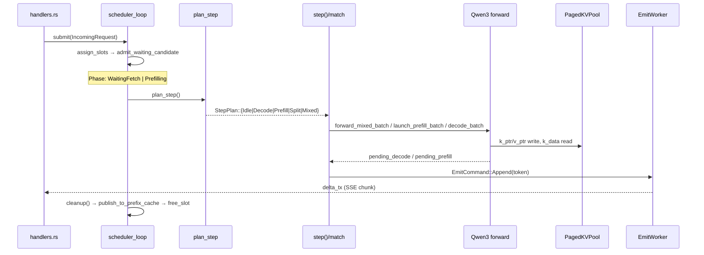
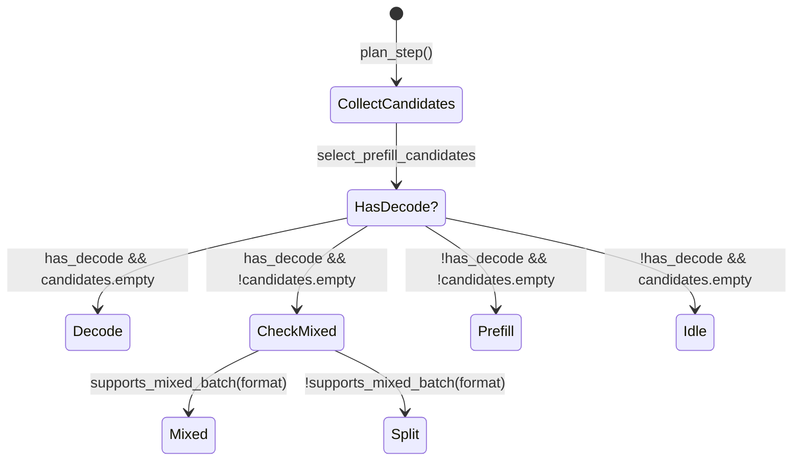

# Scheduler Pipeline Map — CUDA Backend

Date: 2026-04-29
Scope: Qwen3 / Qwen3.5 on the CUDA continuous-batching scheduler. Every claim
about runtime behavior cites a file:line in the current tree.

This doc is a single end-to-end walk-through of how an HTTP request becomes
GPU work and tokens, what GPU buffers exist at each step, and the state
machine that picks `Pure | Split | Mixed | Decode` per scheduler tick. It
also flags why FP8/INT8 KV currently bypass the Mixed plan.

---

## §1 Request lifecycle

### 1.1 Numbered walk-through

1. **HTTP arrival.** `POST /v1/completions` lands at
   [`http_server/handlers.rs::completions`](../../infer/src/http_server/handlers.rs#L509-L585).
   The body is parsed, `RequestExecutionOptions::from_completion(&req)` builds
   the runtime intake record, and a `(delta_tx, delta_rx)` `tokio::mpsc`
   channel is created (handlers.rs:230).
2. **Tokenize + submit.** Inside
   [`submit_request`](../../infer/src/http_server/handlers.rs#L225-L255) the
   prompt is tokenized via `state.tokenizer.encode` under a `tokenize` span
   (handlers.rs:232-240), then `state.handle.submit(incoming)` enqueues an
   `IncomingRequest` on the scheduler's mpsc channel (handlers.rs:247). The
   handler then awaits `delta_rx` for either a buffered response or an SSE
   stream.
3. **Scheduler intake.** The run loop at
   [`scheduler/cuda/runtime/scheduler_loop.rs::run`](../../infer/src/scheduler/cuda/runtime/scheduler_loop.rs#L97-L178)
   drains incoming on every iteration:
   `drain_request_rx` → `drain_coordinator_events` → `drain_emit_events` →
   `wait_for_wakeup` (scheduler_loop.rs:101-104). On wake it calls
   `assign_slots` (scheduler_loop.rs:109) which pulls candidates through
   `collect_admission_candidates` (scheduler_loop.rs:187 → admission.rs:231-258).
4. **Admission.** For each waiting request,
   [`build_prefix_admission_plan`](../../infer/src/scheduler/cuda/runtime/admission.rs#L148-L229)
   classifies prefix hits as `ReadyOnGpu | StagingFromHost | StagingFromDisk |
   Miss` (admission.rs:153-156), then chooses one of four admission shapes:
   direct GPU page attach, staged readmission, same-slot contiguous reuse, or
   cold prefill (admission.rs:140-147 captures the priority order in prose).
   Slot selection happens via
   [`choose_admission_slot`](../../infer/src/scheduler/cuda/runtime/admission.rs#L108-L121),
   then `admit_waiting_candidate` installs `ActiveRequest` into
   `self.active[slot_idx]` with `Phase::WaitingFetch` or `Phase::Prefilling`
   (admission.rs:346-380).
5. **Phase transitions.** The phase enum is defined at
   [`scheduler/cuda/request.rs:213-227`](../../infer/src/scheduler/cuda/request.rs#L213):
   `WaitingFetch → Prefilling { effective_tokens, progress } → Decoding →
   Finished`. There is no explicit `Pending` / `Admitted`; admission goes
   waiting-queue → `Phase::Prefilling` directly (admission.rs:361-368).
   `Phase::WaitingFetch` is only used for staged T1/T2 prefix promotion
   (admission.rs:281,361).
6. **Per-step planning.** Each iteration runs `step()`
   ([execution.rs:353-469](../../infer/src/scheduler/cuda/execution.rs#L353)).
   It first reads back any in-flight prefill/decode launches from the
   previous tick (execution.rs:360-378), then calls `plan_step()`
   (execution.rs:381). The decision tree is the entirety of
   [`plan_step`, lines 327-351](../../infer/src/scheduler/cuda/execution.rs#L327):

   ```rust
   let has_decode = ... slot_is_runnable_decode ... ;
   let candidates = select_prefill_candidates(...);
   if has_decode {
       if candidates.is_empty()                        { return StepPlan::Decode; }
       if self.model.supports_mixed_batch(format)      { return StepPlan::Mixed(candidates); }
       return StepPlan::Split(candidates);             // legacy split launch
   }
   if candidates.is_empty() { StepPlan::Idle } else { StepPlan::Prefill(candidates) }
   ```

7. **Per-plan dispatch.** The match at
   [`execution.rs:395-420`](../../infer/src/scheduler/cuda/execution.rs#L395) routes:
   - `Idle` → no-op.
   - `Decode` → `step_decode_launch` (decode.rs:319-332).
   - `Prefill(c)` → `step_prefill_batch(c)` (prefill.rs:675-688).
   - `Split(c)` → `step_prefill_batch(c)` **then** `step_decode_launch` on
     the same compute stream (execution.rs:407-414). This is two serialized
     launches.
   - `Mixed(c)` → `step_mixed_launch(c)` (decode.rs:334-598), which packs
     decode rows + prefill chunks into one fused varlen forward via
     `forward_mixed_batch` (decode.rs:504-509).
8. **Token emit.** After launch, `dispatch_decode_emits` (execution.rs:181-193)
   pushes generated tokens to the `EmitWorker` (`emit_tx.send(EmitCommand::Append)`
   in core.rs:742-753). The emit worker writes to each request's
   `delta_tx`, the SSE/HTTP handler picks them up.
9. **Termination.** [`step_decode_readback`](../../infer/src/scheduler/cuda/decode.rs#L600-L717)
   syncs sampling, advances `generated_tokens`, and on stop-token (decode.rs:673)
   or `len >= max_tokens` (decode.rs:687-693) calls `finish_request` →
   `finish_slot` (core.rs:803-816). `cleanup()` then publishes the prompt to
   the radix cache (`publish_to_prefix_cache`, core.rs:913-1047) and frees
   pool pages (`evict_prefix_cache_if_pressured`, core.rs:1261-1343).

### 1.2 Sequence diagram



---

## §2 GPU state per StepPlan

`max_batch_size` = scheduler's `max_slots` (typically 16 on L4). `q_dim`
= `num_attention_heads × head_dim`. `kv_dim` = `num_kv_heads × head_dim`.
Numbers on Qwen3-4B (BF16, 36 layers, 32 q-heads, 8 kv-heads, head_dim 128).

| Plan | When fires | Kernels launched (file:line) | KV pool reads | KV pool writes | Concurrent decode? | Stream(s) |
|---|---|---|---|---|---|---|
| `Idle` | no decode, no prefill candidates (execution.rs:346-348) | none | – | – | – | – |
| `Decode` | runnable decode rows present, no prefill candidates pass budget (execution.rs:336-338) | `decode_batch` ([forward.rs:563-577](../../infer/src/model/qwen3/forward.rs#L563), → `decode_batch` for paged path); attention via `decode_prep_paged_cuda` + per-format decode kernel (FlashInfer BF16 / `decode_attention_int8` / `decode_attention_fp8` in `batch_decode.rs::decode_batch`) | `k_data[layer]` / `v_data[layer]` (read whole slot history) | `k_ptr` write target → `quantize_scatter_kv_fp8_range` for FP8 (paged_kv.rs:1556-1574); BF16 writes directly into `k_data` | n/a | `ctx.stream` |
| `Prefill(c)` | no decode rows runnable; prefill candidates fit budget (execution.rs:346-349) | `launch_prefill_batch` → `launch_prefill_paged_batch` ([prefill.rs:317-408](../../infer/src/model/qwen3/prefill.rs#L317)); `PagedPrefillForward::new_hd128` + per-layer `flashinfer` prefill | `k_data[layer]` (history pages) | per-layer prefill writes K/V into pool pages allocated by `cow_tail_page_for_append` + `alloc_tokens` (decode.rs:528-530, paged_kv.rs:498) | no — decode rows wait | `ctx.stream` |
| `Split(c)` | decode rows AND prefill candidates, but `supports_mixed_batch == false` (execution.rs:343-344) | (1) `step_prefill_batch` then (2) `step_decode_launch` on the same stream (execution.rs:407-414) | both | both | **NO — serialized on one stream** | `ctx.stream` |
| `Mixed(c)` | decode rows AND prefill candidates AND `supports_mixed_batch == true` (execution.rs:339-340) | `step_mixed_launch` → `forward_mixed_batch` → `decode_batch_with_prefill` ([batch_decode.rs:474-905](../../infer/src/model/qwen3/batch_decode.rs#L474)). Per layer: GEMMs, then `decode_prep_paged_cuda` (line 654) for decode rows, `prefill_attention_paged_prep_cuda` for each prefill row (line 690), one fused `flashinfer_tc_run_layer` over all rows (line 729). | `k_data[layer]` BF16 only — read by FlashInfer TC (line 733) | `k_ptr(layer)` returns `k_data[layer]` directly when format = BF16 (paged_kv.rs:1170-1178); decode_prep writes K/V in place | **YES — same launch** | `ctx.stream` |

Decode-only readback is in
[`step_decode_readback`](../../infer/src/scheduler/cuda/decode.rs#L600-L717)
(syncs argmax kernel, samples, advances `generated_tokens`). Prefill readback
is in [`step_prefill_readback`](../../infer/src/scheduler/cuda/prefill.rs#L650-L671)
(calls `complete_prefill_batch` which sync-completes the `Qwen3PrefillContext`
plan).

---

## §3 Buffer lifetimes table

Every per-batch GPU buffer with where it's allocated and freed.

| Buffer | Owner struct | Allocated when | Freed when | Size on Qwen3-4B / L4 |
|---|---|---|---|---|
| `paged_kv_pool.k_data[layer]` / `v_data[layer]` | `PagedKVPool` ([paged_kv.rs:39-47](../../crates/cuda-kernels/src/paged_kv.rs#L39)) | Server boot in `PagedKVPool::new` ([paged_kv.rs:333-355](../../crates/cuda-kernels/src/paged_kv.rs#L300)) | Server shutdown (Drop on `CudaSlice<u8>`) | per layer `max_total_tokens × kv_dim × bpe` — BF16: 2 B/elem; FP8: 1 B/elem; INT8: 1 B/elem + scales (paged_kv.rs:330) |
| `paged_kv_pool.k_work` / `v_work` | `PagedKVPool` (`Option<CudaSlice<u8>>` [paged_kv.rs:47](../../crates/cuda-kernels/src/paged_kv.rs#L47)) | Boot, **only when `format.needs_work_buffer()`** i.e. FP8/INT8 (paged_kv.rs:390-400) | Shutdown | **single layer's worth**: `max_total_tokens × kv_dim × 2 B` (paged_kv.rs:391). This is the key fact — `k_work` is per-step scratch shared across layers; it does *not* hold per-layer historical KV. After each layer's attention writes BF16 into `k_work`, `quantize_scatter_kv_fp8_range` (paged_kv.rs:1562-1574) packs it into `k_data[layer]` and the next layer reuses the same scratch. |
| `paged_kv_pool.k_scales` / `v_scales` | `PagedKVPool` | Boot, INT8 only (paged_kv.rs:358-371) | Shutdown | `max_total_tokens × num_kv_heads × 4 B` per layer |
| `paged_kv_pool.k_norms` / `v_norms` | `PagedKVPool` | Boot, TurboQuant only (paged_kv.rs:374-387) | Shutdown | `max_total_tokens × num_kv_heads × 2 B` per layer |
| `BatchDecodeBuffers.q_batch / k_batch / v_batch / attn_output / o_buf / normed / gate_out / up_out / act_out / hidden_out / embedding_out / logits` | `Qwen3` decode bufs ([batch_decode.rs:51-92](../../infer/src/model/qwen3/batch_decode.rs#L51)) | First decode launch via `create_decode_context` (decode.rs:248-263) | Server shutdown | sized for `max_batch_size`. `q_batch` ≈ `max_batch_size × q_dim × 2 B` |
| `MixedBatchBuffers` (`mixed.q_batch`, `mixed.k_batch`, `mixed.v_batch`, `mixed.embedding_out`, `mixed.normed`, `mixed.attn_output`, `mixed.o_buf`, `mixed.act_out`, `mixed.gate_out`, `mixed.up_out`, `mixed.hidden_out`, `mixed.logits`) | `BatchDecodeBuffers.mixed` (`Option<MixedBatchBuffers>` [batch_decode.rs:110-151](../../infer/src/model/qwen3/batch_decode.rs#L110)) | Lazy on first Mixed step via `ensure_mixed_buffers` (batch_decode.rs:524) | Server shutdown | sized for `max_total_tokens` (e.g. 4112). `mixed.q_batch` ≈ `max_total_tokens × q_dim × 2 B` |
| `mixed.token_ids_gpu` | `MixedBatchBuffers` | Same as above | Shutdown | `max_total_tokens × 4 B` |
| `mixed.metadata.{positions, kv_indptr, kv_indices, kv_last_page_len, qo_indptr, flashinfer_ws}` | `MixedBatchMetadata` | Same | Shutdown | small int32 buffers; `flashinfer_ws` sized by FlashInfer plan |
| `prefill_page_table_devs` (per-prefill-row int32 page table) | local `Vec<CudaSlice<i32>>` in `decode_batch_with_prefill` (batch_decode.rs:568-581) | Per Mixed step | End of `decode_batch_with_prefill` (Drop) | one slice per prefill row, `seq_len/page_size` int32 entries |
| `Qwen3State.base.kv_cache.k_work / v_work` (contiguous-cache scratch) | `KVCache` ([kv_cache.rs:35-36](../../infer/src/model/kv_cache.rs#L35)) | Per-state on first INT8 layer (kv_cache.rs:107-130) | State drop | one layer's BF16 — only used by the legacy contiguous-cache path; **not** the paged-pool `k_work` |
| `Qwen3PrefillContext` (paged prefill plan, hidden, page indices dev) | `PrefillContext` set by `launch_prefill_paged_batch` (prefill.rs:401-406) | First prefill launch via `create_prefill_context` (prefill.rs:613-619) | Cleared on `complete_prefill_batch` |
| `prefill_logits[slot_idx]` | `Qwen3State.base` (`Option<DeviceVec>` extracted by `extract_vec_into` in batch_decode.rs:892-901) | First time the slot ends a prefill | State drop | `vocab_size × 2 B` per slot that ever prefilled |

The crown-jewel observation: `paged_kv_pool.k_work` is **one layer's scratch**
shared across all 36 Qwen3 layers (paged_kv.rs:391), not per-layer historical
KV. Any "BF16 shadow of FP8 history" idea fails on this shape — the BF16 view
of layer L is overwritten the moment layer L+1's `decode_prep` runs.

---

## §4 Mixed-decode state machine

### 4.1 Preconditions

The exact gate is a single `&&` chain in
[`forward.rs:579-586`](../../infer/src/model/qwen3/forward.rs#L579):

```rust
fn supports_mixed_batch(&self, kv_pool_format: KVFormat) -> bool {
    self.prefill_uses_paged_pool()
        && self.lora.is_none()
        && matches!(kv_pool_format, KVFormat::BF16)
}
```

- `prefill_uses_paged_pool()` is hard-wired to `true` for Qwen3
  (forward.rs:297-299).
- `lora.is_none()` — LoRA decode allocates per-call temp buffers that don't
  pack into the varlen layout (forward.rs:603-608 documents the related
  CUDA-graph veto).
- `kv_pool_format == KVFormat::BF16` — the only format whose `k_ptr(layer)`
  returns `k_data[layer]` directly without a quantize-scatter step
  (paged_kv.rs:1170-1178).

### 4.2 Per-step transition logic



The decision is in `plan_step` ([execution.rs:327-351](../../infer/src/scheduler/cuda/execution.rs#L327)).
The `select_prefill_candidates` budget gate inside
`PrefillBudget::from_scheduler` reserves decode-completion headroom *before*
admitting prefill rows (execution.rs:107-115), so a Mixed-eligible step is
already constrained: prefill + decode together must fit
`max_num_batched_tokens` and have enough free pool pages.

### 4.3 What `Mixed` actually does

`step_mixed_launch` ([decode.rs:334-598](../../infer/src/scheduler/cuda/decode.rs#L334))
collects decode tokens (decode.rs:340), reselects prefill candidates capped
by `mixed_prefill_token_budget` (decode.rs:349 → execution.rs:286-295),
retracts the lowest-progress decode row if pages don't fit
(`retract_decode_to_fit`, decode.rs:90-111), allocates one pool token per
decode row (decode.rs:375), then calls `forward_mixed_batch` with a
`MixedBatchRequest` (decode.rs:498-509).

`decode_batch_with_prefill` ([batch_decode.rs:474-905](../../infer/src/model/qwen3/batch_decode.rs#L474))
then:

- Refuses non-BF16 / LoRA at the top (batch_decode.rs:481-483) — mirrors the
  `supports_mixed_batch` gate.
- Grows the pool for each prefill row via `cow_tail_page_for_append` +
  `alloc_tokens` (batch_decode.rs:527-530).
- Packs `[decode rows | prefill_1 tokens | prefill_2 tokens | …]` into one
  embedding tensor (batch_decode.rs:532-540).
- Per layer: shared Q/K/V GEMMs (batch_decode.rs:611-628), then
  `decode_prep_paged_cuda` writes decode-row K/V into pool pages
  (batch_decode.rs:653-677), `prefill_attention_paged_prep_cuda` writes each
  prefill row's K/V (batch_decode.rs:679-717), and **one** fused
  `flashinfer_tc_run_layer` runs attention over all rows
  (batch_decode.rs:729-750). This single fused launch is the
  no-serialization core.
- After all layers: in-place compaction gathers the last-prefill-token row
  for each prefill (batch_decode.rs:818-858) and one GEMM produces
  `mixed.logits`.

### 4.4 Why FP8/INT8 cannot enter today

The blocker is the `KVFormat::BF16` arm of the gate at
[forward.rs:585](../../infer/src/model/qwen3/forward.rs#L585), reinforced by
the early return at
[batch_decode.rs:481-483](../../infer/src/model/qwen3/batch_decode.rs#L481).
Two concrete reasons:

1. The Mixed kernel chain assumes `k_ptr(layer) == k_data_ptr(layer)` (BF16
   read-and-write), so FlashInfer TC can read the just-written K/V in the
   same launch. For FP8/INT8 the two pointers diverge: `k_ptr(layer)` is the
   shared `k_work` scratch, which is `quantize_scatter`'d into `k_data[layer]`
   *after* each prep call (paged_kv.rs:1170-1178, paged_kv.rs:1556-1574).
   FlashInfer TC does not consume FP8/INT8 — the per-format
   `decode_attention_fp8` / `decode_attention_int8` kernels do.
2. `decode_attention_varlen_fp8` exists at
   [csrc/attention/decode_attention_varlen_fp8.cu:78](../../crates/cuda-kernels/csrc/attention/decode_attention_varlen_fp8.cu#L78)
   with FFI at
   [src/ffi/attention.rs:541](../../crates/cuda-kernels/src/ffi/attention.rs#L541)
   and a Rust shim at
   [src/kv_quant.rs:382-440](../../crates/cuda-kernels/src/kv_quant.rs#L382),
   so a varlen FP8 decode is callable. **It is not yet wired** into
   `decode_batch_with_prefill`; today the only callers are the pure FP8
   decode path. Lifting the gate means teaching the Mixed body to pick the
   FP8 varlen path when `format == FP8E4M3` and calling
   `quantize_scatter_kv_fp8_range` per layer between prep and attention.
   INT8 has no `decode_attention_varlen_int8` yet — only the per-row variant
   in `kv_quant.rs` — so INT8 needs the kernel templated first, then the
   same wire-up.

---

## §5 Where time goes (c=16, FP8, L4, Qwen3-4B)

Source: `bench-output/2026-04-29-c16fixed-fp8/service_stats_trace_summary.md`
(historical reference, file removed)
plus the server log step breakdowns emitted at
[execution.rs:457-468](../../infer/src/scheduler/cuda/execution.rs#L457).

- 156 service-stats samples over the run, peak active = 16, peak waiting = 7,
  peak prefill_queue = 7, peak `kv_util = 98.4%`.
- "Before" snapshot (line 14): `step_p50=40.0ms`, `decode_rows=1`,
  `prefill_rows=0` — clean decode regime, c=1 idle.
- "After" snapshot (line 20): `service_p50=30000.0ms`, `tpot_p50=100.0ms`,
  `ttft_p99=30000.0ms`. Service p50 is 30 s — decode-bound by very large
  prefill blocks.
- Because the FP8 pool format defeats `supports_mixed_batch`
  (forward.rs:585), every step with both decode and prefill candidates falls
  into the `Split` arm at execution.rs:344. Concretely the user-observed
  pattern: ~55 Split steps × ~500 ms median prefill blocks = ~27.5 s of
  pure-prefill wall time during a 120 s run, ≈34% of wall, driving the c=16
  per-request decode rate to ~5.4 tok/s vs SGLang's ~12.6 tok/s. **Zero
  Mixed steps fire** — the gate at forward.rs:585 returns false on every
  call when format != BF16.

The bench summary surfaces aggregate `step_last`/`step_p50`, but does not yet
break out per-plan timing — that's the gap §6 calls out.

---

## §6 Pending unification work

- **Wire FP8 into the Mixed plan.** The kernel exists
  ([`decode_attention_varlen_fp8_cuda`](../../crates/cuda-kernels/csrc/attention/decode_attention_varlen_fp8.cu#L314));
  the wiring is a localized diff in `decode_batch_with_prefill`
  ([batch_decode.rs:474-905](../../infer/src/model/qwen3/batch_decode.rs#L474)):
  branch on `paged_kv_pool.format`, route FP8 to the varlen FP8 kernel,
  insert per-layer `quantize_scatter_kv_fp8_range` between the prep and the
  attention call. The gate at [forward.rs:585](../../infer/src/model/qwen3/forward.rs#L585)
  lifts to `matches!(format, BF16 | FP8E4M3)` once verified.
- **Add `decode_attention_varlen_int8`.** The companion INT8 kernel does not
  exist yet; only per-row `decode_attention_int8` is present in
  `crates/cuda-kernels/src/kv_quant.rs`. Once landed, the same wire-up
  pattern as FP8 applies.
- **Bench-side observability.** Today the only per-plan timing surface is
  the conditional log line at
  [execution.rs:457-468](../../infer/src/scheduler/cuda/execution.rs#L457),
  printed only when `total_us > 100_000` and the plan is non-idle. The
  metrics emitted via `set_scheduler_step` (execution.rs:430-437) bucket
  decode-rows / prefill-rows / total but not which `StepPlan` arm fired.
  Adding a `plan_label` counter into `/v1/stats` would make Split-vs-Mixed
  distribution visible without grepping logs — directly relevant when
  judging future FP8/INT8 wire-ups.

---

## Discrepancies / open items

- **No `Phase::Pending` or `Phase::Admitted`.** The state-machine the user
  described (`Pending → Admitted → Prefill → Decode → Done`) does not match
  code: `Phase` is `WaitingFetch | Prefilling | Decoding | Finished`
  (request.rs:213-227). Pre-admission, requests live as `IncomingRequest` on
  `self.waiting: VecDeque` (core.rs:131) — they don't have a `Phase` until
  `admit_waiting_candidate` constructs `ActiveRequest`. Doc reflects code,
  not the user's bullet.
- **`Pure` is not a `StepPlan` variant.** The enum has `Idle | Decode |
  Prefill | Split | Mixed` (execution.rs:28-34). The user's "Pure
  (decode-only) / Pure (prefill-only)" naming corresponds to `Decode` and
  `Prefill` respectively; treated as such in §2.
- **`commit_layer` is contiguous-cache-only.** [kv_cache.rs:263-315](../../infer/src/model/kv_cache.rs#L263)
  only quantizes the per-state contiguous `k_work` → `k_cache_q` path. The
  paged-pool path uses `quantize_scatter_kv_fp8_range` (paged_kv.rs:1556-1574)
  inline during the per-layer attention chain, never the `commit_layer`
  helper. The reading list line "`infer/src/model/kv_cache.rs` —
  `commit_layer` orchestration" only applies to the legacy contiguous KV
  cache, which paged Qwen3 does not use.
- **Qwen3-4B sizing numbers** (head/layer counts, page_size, max_total_tokens)
  are framework-driven and depend on `--max-num-batched-tokens` / KV format;
  values quoted are typical L4 + paged-FP8 defaults seen in
  bench-output snapshots, not constants in code. Confirm with a runtime
  `/v1/stats` snapshot before quoting in a paper.
- **`decode_attention_varlen_fp8` "NHD-fixed at 4e4906f5" claim** could not
  be verified from a git-blame in this pass — the kernel is present but the
  commit hash referenced is informational; the doc states only what the code
  shows today (kernel exists, not wired).
