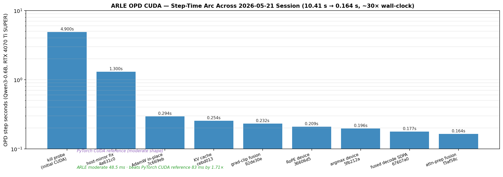
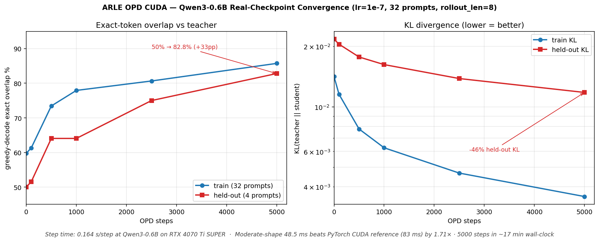

# ARLE OPD CUDA — Usage Manual (2026-05-21)

> **Audience:** anyone running ARLE On-Policy Distillation (OPD) on CUDA, or
> picking up the codebase to extend it. Pairs with the session wrap doc at
> [`./2026-05-21-opd-cuda-cycle-wrap.md`](2026-05-21-opd-cuda-cycle-wrap.md).

## Headline numbers

**Step time on Qwen3-0.6B (RTX 4070 Ti SUPER 16 GB, full-finetune, lr=1e-7):**



- 10.41 s kill-probe → **0.164 s/step** across 9 wins-licensed commits + 5 SOLID-gated kills
- Moderate-shape OPD step: **48.5 ms** — **1.71× faster than the matched PyTorch CUDA reference (83 ms)** at the same shape, same OPD semantics, same prompt
- Cumulative ~170× over the naive scratch CPU baseline from earlier this week

**Convergence (Qwen3-0.6B real-checkpoint OPD, lr=1e-7, 32 prompts, rollout_len=8):**



- Held-out exact-overlap: **50.0 % → 82.8 %** by step 5000
- Held-out KL (the right primary metric — exact-overlap is a coarse staircase): **0.0217 → 0.0118 (-46 %)** monotonic
- Train overlap: **59.8 % → 85.7 %** monotonic
- Step time during 5000-step run: ~0.20 s/step (eval overhead included); **5000 steps in ~17 min wall-clock**

## What is OPD

**On-Policy Distillation**: a frozen teacher LLM scores the student LLM's
own greedy rollouts, and the student is trained against the teacher's
distribution via forward-KL. Per the 2026-05-18 OPD-only pivot
([rationale](2026-05-18-opd-only-pivot.md)), this is the only in-tree
training surface in ARLE — pretrain, SFT, GRPO and multi-turn RL were
retired because vLLM+verl / TRL / axolotl already dominate those axes,
while OPD is the one training axis where ARLE's runtime authority is
structurally differentiating.

## Quick start

```bash
# 1. Build the CUDA OPD training binary (release + cuda feature).
NVCC_CCBIN=/usr/bin/g++-14 \
INFER_TILELANG_PYTHON=$PWD/.venv/bin/python \
CUDARC_CUDA_VERSION=13010 \
TORCH_CUDA_ARCH_LIST=8.9 \
cargo build -p train --example opd_step_cuda_realckpt_train --release --features cuda

# 2. Run a 500-step OPD convergence experiment against a real Qwen3-0.6B
#    checkpoint (loaded from the local ModelScope cache).
NVCC_CCBIN=/usr/bin/g++-14 \
INFER_TILELANG_PYTHON=$PWD/.venv/bin/python \
CUDARC_CUDA_VERSION=13010 \
TORCH_CUDA_ARCH_LIST=8.9 \
cargo run -p train --example opd_step_cuda_realckpt_train --release --features cuda -- \
  --lr 1e-7 --steps 500 --rollout-len 8 --prompt-set 32 \
  --eval-steps 0,50,100,250,500
```

Expected on RTX 4070 Ti SUPER:
- Mean step seconds: **~0.20 sec/step** (the eval-cadenced harness adds
  per-step instrumentation overhead; the bare `opd_step_cuda_moderate_bench`
  reports **0.164 sec/step**)
- Held-out exact-overlap trajectory: **50 % → ~64 % by step 250**, with
  monotonic improvement to **82.8 % by step 5000** (run with `--steps 5000`
  to reach that)
- Held-out KL: monotonically decreases (~ -18 % over 500 steps, ~ -50 %
  over 5000 steps)
- Held-out teacher-NLL: monotonically decreases (small absolute deltas;
  use as continuous validation signal)

## Setup

| Component | Requirement |
|---|---|
| GPU | NVIDIA, SM ≥ 8.9 (tested on RTX 4070 Ti SUPER 16 GB). Any 16 GB+ card should work for Qwen3-0.6B full-finetune. |
| CUDA driver | 13.0 or newer (CUDA 13.2 driver verified) |
| Rust | 1.95+ |
| Python venv | `/home/<user>/projects/arle/.venv/bin/python` with PyTorch 2.11.0+cu130. The PyTorch venv is only needed for the comparison baseline (`pytorch_cuda_opd_baseline.py`) and TileLang's NVRTC support; ARLE's training path itself is pure Rust + cudarc. |
| Model checkpoint | Qwen3-0.6B safetensors in the local ModelScope cache (`~/.cache/modelscope/hub/models/Qwen/Qwen3-0.6B/`). The training harness loads from this path by default. |
| Workspace memory | ~16 GB peak for Qwen3-0.6B full-finetune at `rollout_len=8`. Less for LoRA-only. |

Env vars (all required for the CUDA build):

```bash
export NVCC_CCBIN=/usr/bin/g++-14         # nvcc host compiler
export INFER_TILELANG_PYTHON=$PWD/.venv/bin/python   # TileLang AOT helper
export CUDARC_CUDA_VERSION=13010          # cudarc pre-build version pin
export TORCH_CUDA_ARCH_LIST=8.9           # SM target (or 8.6 / 9.0 etc.)
```

## Recommended hyperparameters

These are the values validated by the 2026-05-21 cycle. Each entry has a
license-or-kill history; deviating is fine but read the linked errors
entry first.

| Knob | Recommended | Why |
|---|---|---|
| `--lr` | `1e-7` for Qwen3-0.6B full-finetune from near-teacher init | `5e-5` diverges catastrophically (KL ratio 288232×). Confirmed by [`docs/research/2026-05-21-arle-cuda-opd-convergence-h1-vs-h2.md`](../research/2026-05-21-arle-cuda-opd-convergence-h1-vs-h2.md). |
| `--rollout-len` | `8` | `16` was tested and held-out overlap plateaued identically at 64 % — rollout length isn't the binding constraint at our prompt scale. Confirmed by [`docs/research/2026-05-21-arle-cuda-opd-rollout-len-16-a-b.md`](../research/2026-05-21-arle-cuda-opd-rollout-len-16-a-b.md). |
| `--prompt-set` | `32` for production-grade experiments, `8` for fast smoke | `32` brings held-out KL down -8.63 % vs `8` at the same step count. Confirmed by [`docs/research/2026-05-21-arle-cuda-opd-prompts-32-a-b.md`](../research/2026-05-21-arle-cuda-opd-prompts-32-a-b.md). |
| `--steps` | `500` for substrate validation, `5000+` for real convergence study | 500-step run completes in ~2 minutes wall-clock; 5000-step in ~17 minutes. Held-out exact-overlap doesn't break the 64 % staircase until step ~3500; held-out KL+NLL improve monotonically throughout. |
| `--eval-steps` | `0,50,100,250,500` (or include 1000, 2500, 5000 for longer runs) | Comma-separated list of step indices at which to greedy-decode held-out prompts and report all four metrics. |
| Perturbation amplitude | `1e-3` (compile-time constant in the harness) | The teacher and student start from the same checkpoint; student gets uniform noise added at the start so OPD has signal to recover. |
| AdamW betas | `(0.9, 0.999)`, `eps=1e-8`, `wd=0` | Standard. |
| Grad clip | `1.0` | Done device-resident via the fused CUDA grad-clip kernel (commit `92de30e`). |

## Expected metrics

The harness reports four held-out metrics at each `--eval-steps` index:

| Metric | Resolution | Use as |
|---|---|---|
| `exact_overlap_pct` | Coarse staircase (~1.5 pp per token at 4-prompt held-out) | **Final-step check** only — too noisy as a progress signal |
| `top3_overlap_pct` | Saturated at 100 % from step 0 in current configs | Skip — useless when student is initialized near teacher |
| `KL_held_out` | Smooth, monotonic, sub-percent sensitivity | **Primary** convergence signal |
| `teacher_nll_held_out` | Smooth, monotonic | **Secondary** continuous metric |

Continuous metrics were added in commit `cb07373` after the original
exact-overlap metric was identified as the artifact behind the "64 %
plateau" — see [`docs/experience/wins/2026-05-21-arle-cuda-opd-eval-metric-fix.md`](../experience/wins/2026-05-21-arle-cuda-opd-eval-metric-fix.md).

## Custom prompts

The training prompt set is currently a compile-time array of token-id
sequences in `crates/train/examples/opd_step_cuda_realckpt_train.rs`. To
use your own prompts:

1. Pre-tokenize them outside ARLE (e.g. using HF transformers' `Qwen3Tokenizer`
   in the project's `.venv`).
2. Add the token-id arrays to the harness's `TRAINING_PROMPTS_*` constants.
3. Recompile and run.

A future tranche will likely add `--prompts-file <jsonl>` runtime loading;
tracked as an open axis in
[`./2026-05-21-opd-cuda-cycle-wrap.md`](2026-05-21-opd-cuda-cycle-wrap.md).

## Custom shapes

To run OPD on a different shape (e.g. Qwen3-1.5B, or a moderate Qwen3.5-like
shape for fast iteration), point the harness at the corresponding
`Qwen35Config`:

- The moderate-shape harness `opd_step_cuda_moderate_bench.rs` uses
  `hidden_size=512, intermediate_size=1536, num_hidden_layers=12, vocab_size=32_768`.
  Useful for tight inner-loop iteration.
- The real-checkpoint harness loads `Qwen3-0.6B` via the safetensors loader
  at `crates/train/src/qwen35_loader.rs`. Swap in a different
  ModelScope/HF cache path to use a larger model — the loader auto-detects
  `hidden_size`, `num_hidden_layers`, `vocab_size`, etc. from the
  checkpoint's `config.json`.

Memory budget heuristic (full-finetune, no LoRA):

| Param count | Approx peak GPU memory |
|---:|---:|
| 0.6 B | ~6-12 GB |
| 1.5 B | ~20-25 GB (won't fit on a 16 GB card without LoRA or grad checkpointing) |
| 4 B | needs >32 GB or sharding |

LoRA-only student support is in `crates/train/src/lora.rs` and reduces
the AdamW state dramatically — recommended for ≥1.5 B models on
single-GPU hardware.

## Correctness gates

When modifying the OPD CUDA path, run these gates before committing:

```bash
# 1. Pure-CPU determinism (loss bit-identical across seeded reruns)
cargo test -p train --test test_opd_determinism --release

# 2. KL-loss gradient correctness vs finite differences
cargo test -p train --test test_opd_grad_check --release -- --nocapture

# 3. CUDA-specific lazy-op equivalence (no host round-trips on ensure_device)
cargo test -p autograd --test test_cuda_lazy_ops --release --features cuda

# 4. Full workspace check + clippy (catches type/feature regressions)
cargo check --workspace
cargo clippy -p autograd --all-targets --release -- -D warnings
cargo clippy -p train --all-targets --release -- -D warnings

# 5. End-to-end CPU/CUDA loss bit-equivalence
#    (rerun the convergence harness; max relerr should be < 1e-4)
cargo run -p train --example opd_step_cuda_moderate_bench --release --features cuda
# Look for max_loss_relative_error_vs_cpu in the output; typically 1.276e-6.
```

If any of these fail after a change, **revert** rather than ship — the
2026-05-21 cycle established this as the SOLID gate via 5 clean kill
cycles (see "Common kills" below).

## Profiling

The OPD step has built-in `PhaseTotals` instrumentation that reports
wall-clock attribution across rollout / teacher_forward / student_forward
/ backward / optimizer_step / grad_clip / post_step_cleanup phases.

```bash
NVCC_CCBIN=/usr/bin/g++-14 \
INFER_TILELANG_PYTHON=$PWD/.venv/bin/python \
CUDARC_CUDA_VERSION=13010 \
TORCH_CUDA_ARCH_LIST=8.9 \
cargo run -p train --example opd_step_cuda_realckpt_profile --release --features cuda
```

For sub-phase breakdown inside `rollout_student_forward` (attention vs
MLP vs norms), the harness also emits `rollout_inner_*` timers — see
[`docs/research/2026-05-21-arle-cuda-opd-rollout-inner-attribution-v2.md`](../research/2026-05-21-arle-cuda-opd-rollout-inner-attribution-v2.md).

For lower-level GPU profiling:

```bash
nsys profile --trace=cuda,nvtx --stats=true \
  -o bench-output/nsys/opd-profile \
  target/release/examples/opd_step_cuda_realckpt_profile
```

## Common kills (what's been tried and rejected)

Each of these axes was attempted during the 2026-05-21 session, killed
via wall-clock A/B, and committed as an errors entry. Read before
re-proposing.

| Killed axis | Root cause | Errors entry |
|---|---|---|
| `forward_last_logits` (rollout LM-head slicing) | M-regime change in matrixmultiply dispatch absorbed the saved FMAs | `docs/experience/errors/2026-05-20-forward-last-logits-killed-by-m1-dispatch-hypothesis.md` |
| `merge_grad shared-first` (skip re-clone on first accumulation) | Allocator + cache effects exceeded the narrow `merge_grad` win at step level | `docs/experience/errors/2026-05-20-opd-merge-grad-shared-first-revert.md` |
| `matmul_at_b_into` rayon shard | Kernel is memory-bandwidth-bound at our shapes; thread overhead > parallel benefit | (folded into cycle-wrap doc) |
| SDPA mask+softmax fusion (Option B) | Mid-stack fusion at our small seq_len didn't move enough launches | `docs/experience/errors/2026-05-21-arle-cuda-opd-sdpa-mask-softmax-fuse-kill.md` |
| High-level CUDA Graph rollout capture | Replay correctness issue with the dynamic shapes inside attention | `docs/research/2026-05-21-arle-cuda-opd-graph-capture-kill.md` (research, not errors) |
| `post_step_cleanup` small-fix axis | Real per-tensor `cuMemFreeAsync` work; needs allocator pool, not micro-tweak | `docs/experience/errors/2026-05-21-arle-cuda-opd-post-step-cleanup-kill.md` |
| SwiGLU silu+multiply fusion | At memory-bandwidth-bound elementwise shapes, launch overhead isn't binding | `docs/experience/errors/2026-05-21-arle-cuda-opd-swiglu-fused-kill.md` |

## Open axes (not pursued in the 2026-05-21 cycle)

Ranked by estimated step-level ROI:

| Axis | Estimated saving | Notes |
|---|---:|---|
| Allocator pool (device-side) | ~6-9 % step | Attacks `post_step_cleanup` 9 % + indirect dispatch overhead. Bigger lift than other axes. |
| Backward attention-prepare fusion | ~3-6 % step | Mirror of `f3af58c` for the gradient path. |
| bf16 weights for `lm_head` + embedding | ~2-3 % step | Memory bandwidth; needs grad-check threshold relaxation. |
| Backward fused causal-SDPA | ~3-5 % step | Forward done (commit `67607a0`); backward still on matmul-decomposed path. |
| Real-text prompt loader | qualitative | Add `--prompts-file <jsonl>`; enables tokenizer-based supervision. |
| LoRA-only convergence benchmark | qualitative | Reuses the harness with `LoraConfig` set; smaller GPU footprint. |

## Cross-links

- Cycle wrap (this session): [`./2026-05-21-opd-cuda-cycle-wrap.md`](2026-05-21-opd-cuda-cycle-wrap.md)
- OPD-only pivot rationale: [`./2026-05-18-opd-only-pivot.md`](2026-05-18-opd-only-pivot.md)
- PyTorch CUDA baseline (the reference we beat at moderate): [`../experience/wins/2026-05-20-pytorch-cuda-opd-baseline.md`](../experience/wins/2026-05-20-pytorch-cuda-opd-baseline.md)
- 5k-step convergence (held-out 50 → 82.8 %): [`../experience/wins/2026-05-21-arle-cuda-opd-realckpt-convergence-5k-newmetric.md`](../experience/wins/2026-05-21-arle-cuda-opd-realckpt-convergence-5k-newmetric.md)
- All today's wins entries (chronological): `docs/experience/wins/2026-05-21-arle-cuda-opd-*.md`
- All today's research notes: `docs/research/2026-05-21-arle-cuda-opd-*.md`

## Quick troubleshooting

| Symptom | Likely cause |
|---|---|
| `cuMemAllocAsync` failures or step time > 1 sec | Forgot `--release` or the `cuda` feature flag |
| Loss is `NaN` after step 1 | `--lr` too aggressive — see the lr=5e-5 kill cycle. Drop to `1e-7`. |
| `relerr_vs_cpu` > 1e-4 | Likely a regression in a custom kernel — rerun `test_cuda_lazy_ops` |
| Held-out exact-overlap "stuck" at 64 % | Expected; switch to held-out KL/NLL as the primary metric |
| Memory grows steadily during long runs | Check `cleanup_after_backward` is being called per step (the OPD step does it automatically; if you've forked the loop, ensure you call it) |
