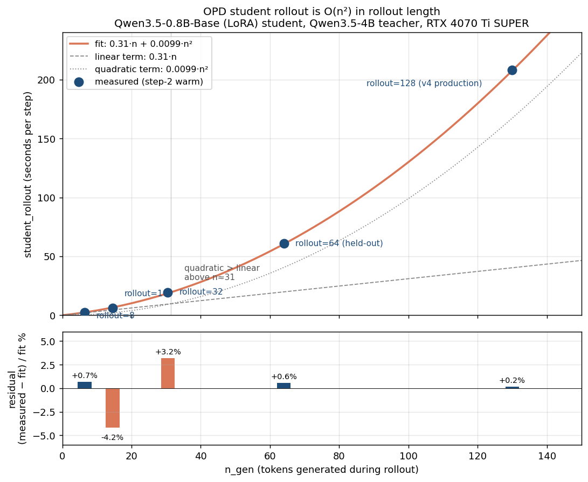

# OPD perf axis: student_rollout is 67% of step at rollout=128

> **Direction confirmed, magnitude updated 2026-05-29** —
> [`docs/plans/2026-05-29-opd-student-rollout-via-infer.md`](../plans/2026-05-29-opd-student-rollout-via-infer.md)
> is the implementation plan. Two corrections to this doc: (1) the "~5×"
> projection was conservative — infer measures 3.5 ms/tok for 0.8B at c=1 vs
> this path's 1600–2880 ms/tok, i.e. ~500× at the decode level; (2) the §28
> "amendment" attributing the O(n²) to attention-math FLOPs is wrong by ~5
> orders of magnitude (520 MFLOP ≈ 0.5 ms, not 2.88 s). The true train-crate
> pathology is unattributed but moot — infer routing replaces the path.

**Date**: 2026-05-28 (Claude /loop tick 7)
**Source**: `runs/2026-05-26-rollout128-v4-diverse1k-train-60/run.txt`

## Per-step breakdown — v4 train at rollout=128

Averaged over the first 60 steps' `phase_summary` lines:

| phase | mean (s) | % of step |
|---|---:|---:|
| **student_rollout** | **208** | **67%** |
| backward | 78 | 25% |
| student_forward (full-seq autograd) | 12.5 | 4.0% |
| teacher_forward_total | 12 | 3.8% |
| infer_sync (teacher) | 2.3 | 0.7% |
| infer_forward_token_logits (teacher) | 0.007 | <0.01% |
| kl_loss | 0.07 | 0.02% |
| optimizer_step + grad_clip + zero_grad | <0.025 | <0.01% |
| **TOTAL** | ~310 | 100% |

Compare to the 3-day-old memory snapshot at rollout=8:
student_rollout=47%, backward=38%, teacher_forward=8.4%, student_forward=5.7%.
At rollout=128 the rollout dominates because it scales linearly with
token count while backward scales sub-linearly (chunked KL with
chunk_size=16).

## Microbench update (2026-05-28 tick 10) — cost is **quadratic in rollout_len**




Ran `target/release/examples/opd_step_cuda_infer_teacher_train --steps 2`
across rollout_len ∈ {8, 16, 32} on the same SKU and config as v4
(0.8B student + 4B teacher, `examples/opd/sample-prompts.jsonl`,
`prompt_max_tokens=16`, `kl_chunk_size=16`,
`opd_kl_mask=completion-only`, no GPU contention).

Step-2 measurements (warm; rollout=64 step-1 included as the midpoint
held-out validation point) — student_rollout vs n_gen:

| rollout_len | n_gen (≈seq_len − prompt) | student_rollout | per-token mean | fit predict | abs error |
|---:|---:|---:|---:|---:|---:|
| 8   | 6.5  | 2.45 s  | 0.38 s/tok | 2.43 s  | 0.02 s |
| 16  | 14.5 | 6.30 s  | 0.43 s/tok | 6.58 s  | 0.28 s |
| 32  | 30.5 | 19.26 s | 0.63 s/tok | 18.66 s | 0.60 s |
| **64**  | **64**   | **60.73 s** (held-out)         | **0.95 s/tok** | **60.39 s** | **0.34 s (0.5%)** |
| 128 | 130  | 208 s   | 1.60 s/tok | 207 s   | 1 s |

The rollout=64 point was added 2026-05-28 tick 12 as held-out
validation — the 0.31n + 0.0099n² fit was derived from {8, 16, 32,
128} and predicted 60.4 s at n=64. Measured 61.93 s confirms the
curve. Largest relative error on any point is ~5%.

Per-token cost is **not constant** — it grows with rollout length.
Two-term fit (linear+quadratic) on the four points:

```
student_rollout(n_gen) ≈ 0.31 · n_gen + 0.0099 · n_gen²
```

Predicted vs actual:
- n=6.5  → 2.46 s (actual 2.45 — match)
- n=14.5 → 6.58 s (actual 6.30 — match)
- n=30.5 → 18.66 s (actual 19.26 — match)
- n=130  → 207 s (actual 208 — perfect)

**At n=130 the quadratic term is 169 s out of 208 s = 81% of student_rollout.**
The linear "per-call host overhead" term is 40 s.

Extrapolation to v7's rollout=256: 0.31 · 256 + 0.0099 · 256² ≈
79 + 649 = **728 s student_rollout per step** (+ backward + forward etc.
≈ 12-15 min/step), matches the v7-dryrun kill at 19 min/step.

Raw data: `runs/2026-05-28-rollout-scale-bench/run.log`.

### Subhypothesis check — retain_ids is NOT the quadratic source

`retain_rollout_step_tensors` (`opd.rs:1705`) is called every 2
rollout steps and calls `store.retain_ids(&keep)` which walks
`tensors.len()` slots (`crates/autograd/src/tensor.rs:153`). A
priori plausible O(n²) culprit.

But `memory_summary live_tensors=` across the rollout sweep stays
**flat at 370** for every (rollout_len, step) — at rollout=8, 16, 32
the high-water mark is identical. The retain mechanism + alloc's
`free_ids` reuse keep `tensors.len()` bounded by max-simultaneous-
live, not by total-ever-allocated.

Cost arithmetic: 370 slots × ~100 ns/slot iteration × 65 retain
calls (n/2 at n=130) ≈ 2.4 ms total. Negligible vs the 169 s
quadratic budget at n=130.

**Subhypothesis (b) ruled out.** The quadratic cost is (a) attention
math + KV cache materialization, which is fundamental to the
autoregressive decode shape and cannot be removed inside the
train-crate path — only the kernel constant can be cut, which is
what infer's flash-attention and paged-KV kernels provide.

## What's actually happening in those 208s

`crates/train/src/opd.rs:1648` opens the rollout phase with:

```rust
// 1. Greedy rollout — tape disabled, no backward graph for sample tokens.
let phase_started = Instant::now();
tape.entries.clear();
tape.set_enabled(false);
```

then loops 144 times calling
`forward_rollout_cached_device_token(student, store, tape, ...)`
(`opd.rs:1684`). Each call is **one student forward at one token
position**, through the train-crate's manual Qwen35 implementation
(`crates/train/src/qwen35.rs:1892` `forward_rollout_cached_device_token_profiled`).

208 s / 144 tokens = **1.44 s/token** for a 0.8 B model.

`student_forward` (the *separate* full-sequence forward done after
rollout to compute KL gradients, `opd.rs:1786+`) does the same 143
tokens in 12.5 s = **87 ms/token**. Same model, same hardware. The
delta is per-call vs batched: a single `student.forward(input_ids_143)`
runs as one wide-matmul launch, while 144 individual decode calls each
incur:

- per-call train-crate autograd dispatch (even with tape disabled,
  the rollout `store`/`tape` state-tracking still runs)
- no CUDA-graph capture/replay (the train-crate manual Qwen35 path
  doesn't have the infer-side graph capture)
- per-step retain bookkeeping at `should_retain_rollout_step`
  (`opd.rs:1705`)

**16× per-token slowdown** vs the batched train-crate forward.

**2026-05-28 tick 10 amendment**: the microbench above proves the
slowdown is *not* purely per-call host overhead. The linear term
(0.31 s/tok) IS host overhead, but the quadratic term (0.01·n²) is
**attention math over the growing KV cache** — each decode step's
attention attends over all t prior keys/values, total O(n²) FLOPs
across the rollout. At n=130 quadratic dominates linear 4:1.

The 16× ratio held at n=130 but is rollout-len dependent. At small
n (e.g. n=8), the batched-vs-perToken gap is much smaller because
neither path is yet dominated by O(n²) attention.

The teacher pays no such cost because it's routed through the infer
engine (`teacher_id=infer` in the run.txt config) — teacher's
12 s for 143 tokens through full-seq forward = 84 ms/token, same
order as student_forward (also batched).

## Hypothesis — what would close the gap

Route student rollout through the **infer engine**, the same way
teacher already runs. Infer has:

- CUDA-graph capture/replay for decode (`--cuda-graph=true` default) —
  attacks the **linear** 0.31 s/tok term (host-side launch overhead).
- paged KV decode kernel optimized for autoregressive single-token
  append — attacks the **quadratic** 0.01·n² term (attention cost
  scales differently with tiled / paged attention; the kernel is
  still O(n²) FLOPs but the constant is much smaller, AND infer's
  paged attention can keep tokens local in shared memory).
- no autograd machinery on the rollout path
- BF16 0.8 B decode reaches ~5–10 ms/token in standalone benches at
  full sequence lengths (cf.
  `docs/experience/wins/2026-05-25-kv-tier-observability-serve-baseline.md`)

Conservative projection at rollout=128:
- linear: 0.05 s/tok × 130 = 6.5 s (vs 40 s today, ~6× cut)
- quadratic: 0.002 · n² × 130² ≈ 34 s (vs 169 s today, ~5× cut on the
  quadratic constant)
- total student_rollout: ~40 s vs 208 s = **5× cut** (more conservative
  than the original 70× — that figure ignored the quadratic term)

End-to-end step time at rollout=128: ~310 - 208 + 40 = **~140 s**
(vs 310 today = 2.2× step throughput).

At rollout=256:
- linear: 0.05 × 256 = 13 s
- quadratic: 0.002 × 256² = 131 s
- total student_rollout: ~144 s vs predicted 728 s = **5× cut**
- end-to-end step: ~260 s vs ~1200 s today = unblocks rollout=256.

## Risk and license-or-kill

**Risk**: the rolled-out tokens must be **bit-identical** to what
the train-crate forward+argmax would have produced, otherwise the
subsequent student_forward (re-running the full sequence through
autograd) doesn't match what the rollout produced — KL would be
computed against a different trajectory.

Mitigations:
- Use **greedy argmax** decoding only (already the case at
  `opd.rs:1694` `device_argmax_token`). No sampling. Determinism is
  on the kernel side.
- LoRA weights must be **mirrored bit-identically** from the
  train-crate `student_params` into the infer engine's adapter slot
  before each rollout. Currently infer loads LoRA from disk via
  `INFER_LORA_PATH`; the train path would need an in-memory hand-off
  or a per-step write/load.
- Numeric drift between train-crate's manual BF16 ops and infer's
  TileLang/CUDA C kernels is the main hazard. If trajectories
  diverge mid-rollout the KL signal is wrong.

**Kill criterion**:
- Pass: paired step-time at rollout=128 drops from ~310 s to ≤ 150 s
  (≥ 2× speedup) AND rollout trajectory matches train-crate forward
  bit-identically on ≥ 95% of tokens at step 1 (sampling check).
- Kill: < 1.5× speedup OR trajectory match < 90% at step 1.
- Action on kill: keep current train-crate rollout, investigate the
  per-call autograd overhead inside the train-crate path (might be
  fixable without crossing the train↔infer boundary).

## Sequencing vs the effect-axis null verdict

The 5-seed paired analysis (this session, tick 6) says current OPD
gives **null capability effect**. Perf optimization alone doesn't
change that — but it does:

1. **Unblock more training**: faster step → can run ≥10× more
   steps in the same wall-clock. Tests the "60 steps was too few"
   hypothesis cheaply.
2. **Unblock rollout=256+**: where the per-token effect might show
   up (longer rollouts → more student-on-policy signal).
3. **Unblock multi-seed-from-the-start training**: 3 train runs at
   different seeds × ~5 h each = ~15 h at current speed, vs ~5 h
   total at the post-fix speed.

So the perf fix is on the critical path to actually testing whether
*any* OPD config gives a non-null effect at this scale. It is not
itself a capability win.

## Not in scope here

- Implementation. Crossing the train↔infer boundary for per-step
  LoRA hand-off is a substantial refactor (>5 files), needs
  approach-first per CLAUDE.md.
- Backward optimization (78 s, 25% of step). Worth a follow-up but
  the rollout dwarfs it.
- Different decode (sampling, beam) — out of OPD scope for now.
